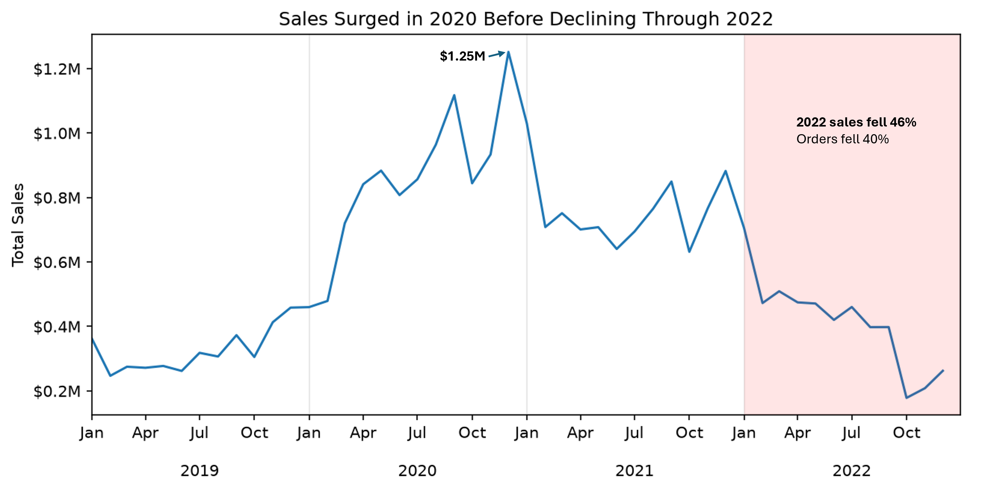
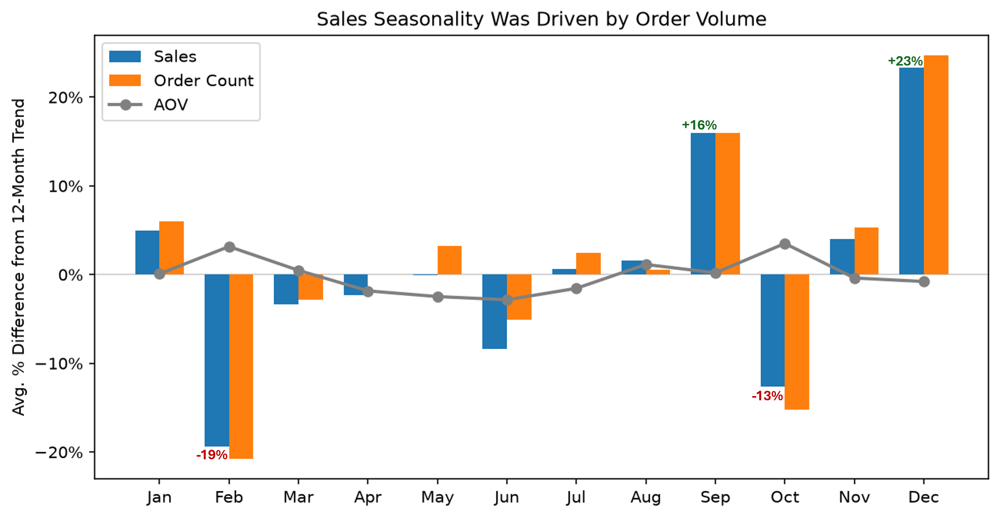
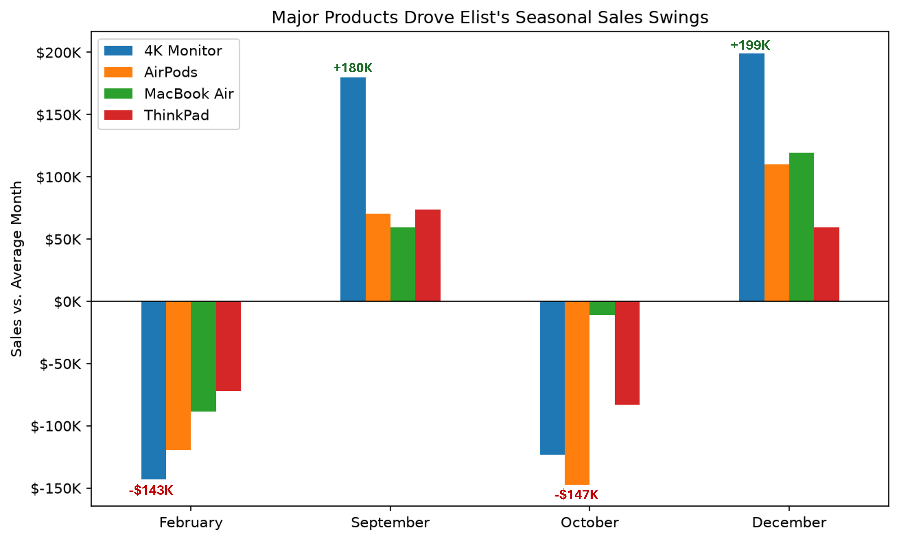
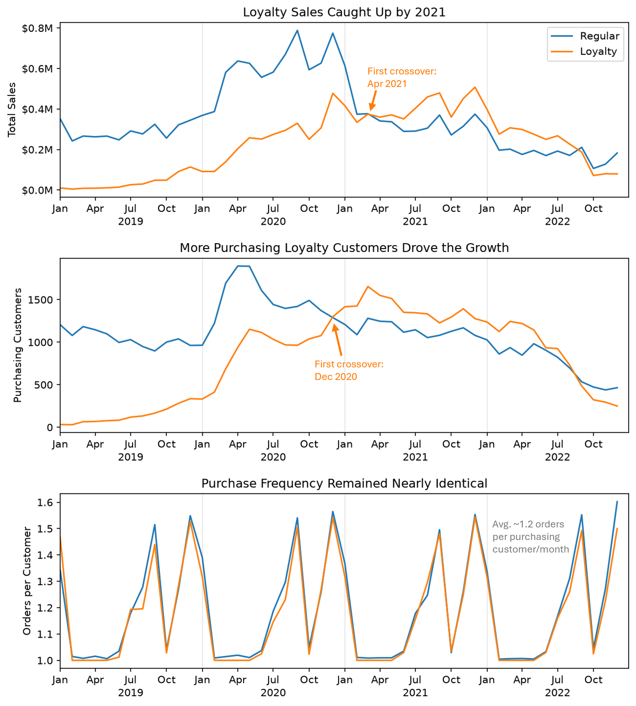
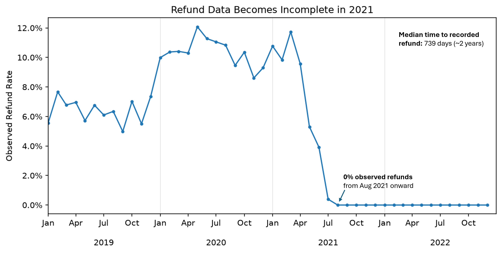
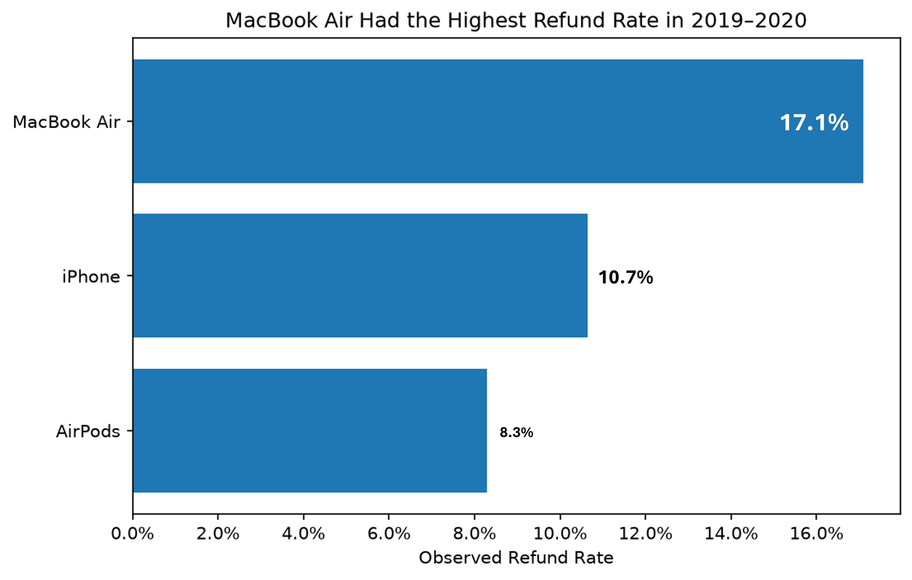

# Elist E-Commerce Analysis

Sales trends, loyalty program, and refund analysis for a global e-commerce company from 2019-2022.

[View the full technical notebook](elist_analysis.ipynb) · [View the stakeholder follow-up SQL queries](stakeholder_followups.sql)

## Business Problem & Context

Elist is a global e-commerce company that sells consumer electronics through its website and mobile app. Founded in 2018, the company sells products from brands including Apple, Samsung, and ThinkPad across North America, EMEA, APAC, and LATAM.

After several years of rapid growth, Elist's leadership wanted a clearer understanding of how the business had performed from 2019 through 2022 and what was driving changes in sales. The Head of Operations also wanted to evaluate the performance of the loyalty program and better understand refund behavior for Apple products.

The analysis covers more than 108K orders and focuses on three core sales metrics: **total sales, order count, and average order value (AOV).**

The analysis was designed to answer four business questions:

1. **What were the overall trends in sales from 2019-2022?**
2. **How did monthly and yearly sales growth change over time?**
3. **How is the loyalty program performing, and should Elist continue using it?**
4. **What do refund rates and AOV reveal about the performance of Apple products?**

## Executive Summary

Elist experienced rapid growth through 2020 before sales began declining in 2021 and fell sharply in 2022. The 2022 decline was primarily driven by fewer orders rather than lower order values and became especially severe during the second half of the year.

The analysis also found a recurring seasonal pattern driven by order volume, substantial growth in Elist's loyalty customer segment, and elevated refund risk for MacBook Air. The largest opportunities are to understand and recover lost order volume, better measure the impact of the loyalty program, and investigate the causes of MacBook Air refunds.

## Key Insights

### Sales peaked in 2020 before falling sharply in 2022

Sales increased 163% in 2020 as both order volume (+101%) and AOV (+31%) rose. The higher AOV was driven primarily by a shift toward higher-value products rather than broad price increases.

In 2022, sales fell 46% year over year. The decline was primarily an order-volume problem: orders fell 40% while AOV declined 10%, with the slowdown becoming especially severe during the second half of the year.

### Seasonal sales changes were driven by order volume

After accounting for the 12-month trend, December sales averaged about 23% above trend and September about 16% above trend. February and October were the weakest months. These swings were driven primarily by changes in order volume rather than AOV.

The pattern appeared across most major products, but the largest dollar swings came from Elist's highest-revenue products.

The 4K gaming monitor contributed nearly half of September's above-normal sales and was also the largest contributor to December strength. October weakness was concentrated primarily in AirPods and the 4K monitor.

December strength is consistent with holiday shopping, while September may partly reflect back-to-school and college demand. These external patterns provide plausible context but do not establish causation. The recurring October weakness does not have a clear explanation from the available data.

### Loyalty sales growth came from more purchasing customers, not higher purchase frequency

At first glance, the loyalty program appears to be performing strongly. Loyalty sales grew from a small base and eventually caught up to or exceeded regular-customer sales.

However, the increase was driven primarily by growth in the number of loyalty customers making purchases. Purchase frequency remained nearly identical between the two groups at roughly 1.2 orders per purchasing customer per month.

Sales per purchasing loyalty customer also caught up to regular customers by 2021, but this improvement came primarily from higher spending per order rather than more frequent purchases.

The available data does not show that loyalty membership itself caused customers to change their purchasing behavior. Elist should continue the program for now while tracking retention, incremental spending, and program costs to better measure its impact.

### MacBook Air had the highest Apple refund risk

Refunds were typically recorded about two years after purchase, which makes the more recent purchase periods incomplete.

Observed refund rates begin falling sharply during 2021 and reach nearly 0% by the second half of the year. All 2022 purchase months show 0% observed refunds. Because of this reporting lag, the final product comparison focuses on 2019-2020 orders.

MacBook Air had an observed refund rate of about 17%, compared with 11% for iPhone and 8% for AirPods.

MacBook Air also had about $618K in sales associated with refunded orders, and its elevated refund rate appeared across every region. APAC was highest at about 22%, suggesting a broader product-level issue rather than one isolated market.

The dataset does not include actual refund amounts, so the $618K represents potential exposure rather than confirmed refunded revenue.

## Recommendations

- **Sales & Marketing - Investigate the late-2022 order decline.** The slowdown was driven primarily by fewer orders, with the 4K monitor, AirPods, MacBook Air, and ThinkPad accounting for most of the lost sales. Elist should examine customer acquisition and retention, marketing performance, product availability, and competitive pricing to determine why its decline was steeper than the broader technology market.

- **Operations & Marketing - Plan around recurring seasonal demand.** September and December consistently outperformed trend, while February and October were weaker. Inventory and promotional activity should reflect these patterns to better prepare for stronger demand and reduce the risk of overstock during slower periods.

- **Marketing / CRM - Continue the loyalty program while improving how its impact is measured.** Loyalty customers eventually matched or exceeded regular customers in sales per purchasing customer, but purchase frequency did not increase. Elist should track retention, repeat purchasing, incremental spending, and program costs to determine whether loyalty membership is actually changing customer behavior.

- **Product & Operations - Investigate MacBook Air refunds.** MacBook Air had the highest observed refund rate and the largest potential financial exposure among the Apple products analyzed. Refund reasons, product quality, fulfillment issues, supplier differences, and product versions should be reviewed, with additional attention given to APAC where the observed refund rate was highest.

## Data & Technical Process

The source data was cleaned and analyzed primarily in Python using pandas and Matplotlib. Excel was also used during the initial data-cleaning workflow. The analysis included data-quality checks, timestamp and product-name standardization, geographic mapping, exploratory analysis, trend analysis, and customer- and product-level comparisons. 

Five follow-up questions from the Head of Operations were answered in BigQuery SQL, covering MacBook sales, delivery times, refunds, regional product popularity, and loyalty purchasing behavior.

The ERD below shows the structure of the source data.

The [full technical notebook](elist_analysis.ipynb) contains the complete cleaning process, calculations, visualizations, and supporting analysis.

## Assumptions & Caveats

- **Refund data has a substantial reporting lag.** Refunds were typically recorded about two years after purchase, so 2021 is less complete and 2022 is not suitable for reliable refund-rate comparisons. Actual refund amounts and refund reasons are also unavailable.

- **The loyalty program cannot be fully evaluated from the available data.** Program costs, discounts, rewards, enrollment details, and retention data are not provided, so the analysis cannot determine the program's ROI or whether membership itself caused changes in customer behavior.

- **Seasonality should be treated as directional.** The dataset covers only four years and includes the unusual pandemic period, so patterns such as September and December strength should be validated with additional years of data.

- **External events provide context but do not establish causation.** Pandemic-related changes, consumer technology demand, inflation, holiday shopping, and back-to-school activity align with several Elist trends, but their individual effects cannot be isolated with the available data.