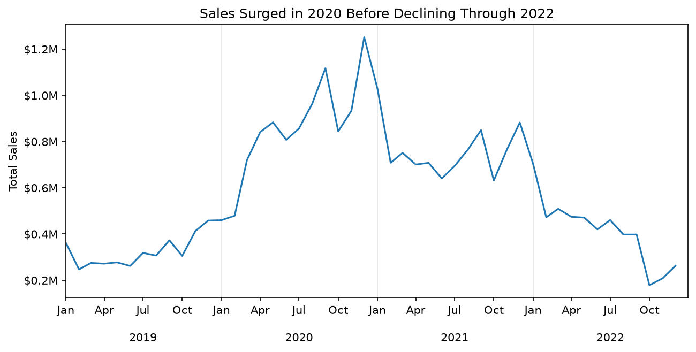
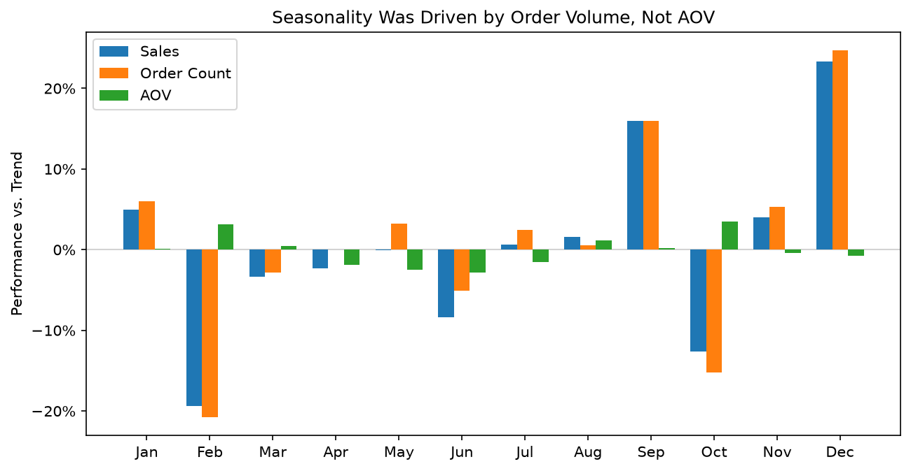
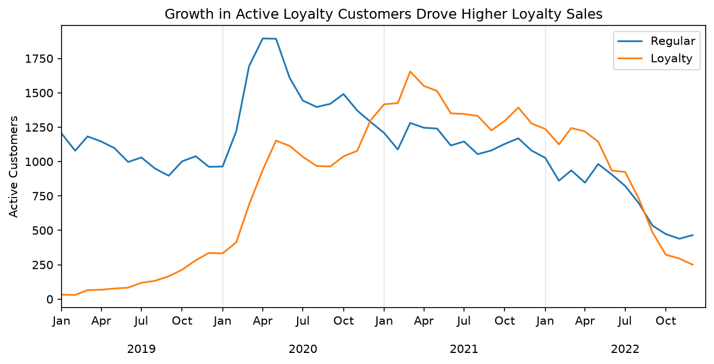

# Elist E-Commerce Analysis

Sales trends, loyalty program, and refund analysis for a global e-commerce company from 2019-2022.

[View the full technical notebook](elist_analysis.ipynb)

## Project Background

Elist is an e-commerce company that sells consumer electronics through its website and mobile app. The company has a global customer base and sells products from brands including Apple, Samsung, and ThinkPad.

This analysis covers 108K orders from 2019-2022 and was completed for the Head of Operations. The goal was to understand overall sales trends, identify what drove changes in performance, evaluate the loyalty program, and examine refund rates for Apple products.

The analysis focused on three core sales metrics: **total sales, order count, and average order value (AOV).**

## Executive Summary

Elist experienced rapid growth through 2020 before sales began declining in 2021 and fell sharply in 2022. The 2022 decline was primarily driven by fewer orders rather than lower order values and became especially severe during the second half of the year.

The analysis also found a recurring seasonal pattern driven by order volume, substantial growth in Elist's loyalty customer segment, and elevated refund risk for MacBook Air. The largest opportunities are to understand and recover lost order volume, better measure the impact of the loyalty program, and investigate the causes of MacBook Air refunds.

## Key Insights

### Sales peaked in 2020 before falling sharply in 2022

Sales increased 163% in 2020 as both order volume (+101%) and AOV (+31%) rose. The higher AOV was driven primarily by a shift toward higher-value products rather than broad price increases.

By 2022, sales had fallen 46%. The decline was primarily an order-volume problem: orders fell 40% while AOV declined 10%, with the slowdown becoming especially severe during the second half of the year.

### Seasonal sales changes were driven by order volume

After removing the long-term trend, December sales averaged about 23% above trend and September about 16% above trend. February and October were the weakest months.

The pattern appeared across most major products and was driven primarily by changes in order volume rather than AOV. December strength is consistent with holiday shopping, while September may partly reflect back-to-school and college demand.

### Loyalty growth came from more active customers

The loyalty segment grew from a small base of active customers in 2019 to matching or exceeding regular customers during much of 2021 and early 2022.

However, orders per active customer remained around 1.2 for both groups. Loyalty sales therefore grew mainly because Elist had more active loyalty customers and those customers eventually spent more per order, not because they purchased more frequently.

The available data does not show that joining the loyalty program caused the improvement, so Elist should continue tracking retention, repeat purchasing, incremental spending, and program costs.

### MacBook Air had the highest Apple refund risk

Since refunds were typically recorded about two years after purchase, this comparison focuses on 2019-2020 orders. MacBook Air had an observed refund rate of about 17%, compared with 11% for iPhone and 8% for AirPods.

MacBook Air also had about $618K in sales associated with refunded orders, and its elevated refund rate appeared across every region. APAC was highest at about 22%, suggesting a broader product-level issue rather than one isolated market.

The dataset does not include actual refund amounts, so the $618K represents potential exposure rather than confirmed refunded revenue.

## Recommendations

- **Sales & Marketing - Investigate the late-2022 order decline.** The slowdown was driven primarily by fewer orders, with the 4K monitor, AirPods, MacBook Air, and ThinkPad accounting for most of the lost sales. Elist should examine customer acquisition and retention, marketing performance, product availability, and competitive pricing to determine why its decline was steeper than the broader technology market.

- **Operations & Marketing - Plan around recurring seasonal demand.** September and December consistently outperformed trend, while February and October were weaker. Inventory and promotional activity should reflect these patterns to better prepare for stronger demand and reduce the risk of overstock during slower periods.

- **Marketing / CRM - Continue the loyalty program while improving how its impact is measured.** Loyalty customers eventually matched or exceeded regular customers in sales per active customer, but purchase frequency did not increase. Elist should track retention, repeat purchasing, incremental spending, and program costs to determine whether loyalty membership is actually changing customer behavior.

- **Product & Operations - Investigate MacBook Air refunds.** MacBook Air had the highest observed refund rate and the largest potential financial exposure among the Apple products analyzed. Refund reasons, product quality, fulfillment issues, supplier differences, and product versions should be reviewed, with additional attention given to APAC where the observed refund rate was highest.

## Data & Technical Process

The source data was cleaned and analyzed primarily in Python using pandas and Matplotlib. Excel was also used during the initial data-cleaning workflow. The analysis included data-quality checks, timestamp and product-name standardization, geographic mapping, exploratory analysis, trend analysis, and customer- and product-level comparisons.

The ERD below shows the structure of the source data.

The [full technical notebook](elist_analysis.ipynb) contains the complete cleaning process, calculations, visualizations, and supporting analysis.

## Assumptions & Caveats

- **Refund data has a substantial reporting lag.** Refunds were typically recorded about two years after purchase, so 2021 is less complete and 2022 is not suitable for reliable refund-rate comparisons. Actual refund amounts and refund reasons are also unavailable.

- **The loyalty program cannot be fully evaluated from the available data.** Program costs, discounts, rewards, enrollment details, and retention data are not provided, so the analysis cannot determine the program's ROI or whether membership itself caused changes in customer behavior.

- **Seasonality should be treated as directional.** The dataset covers only four years and includes the unusual pandemic period, so patterns such as September and December strength should be validated with additional years of data.

- **External events provide context but do not establish causation.** Pandemic-related changes, consumer technology demand, inflation, holiday shopping, and back-to-school activity align with several Elist trends, but their individual effects cannot be isolated with the available data.